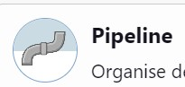
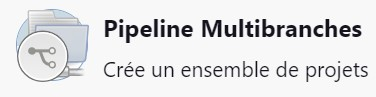
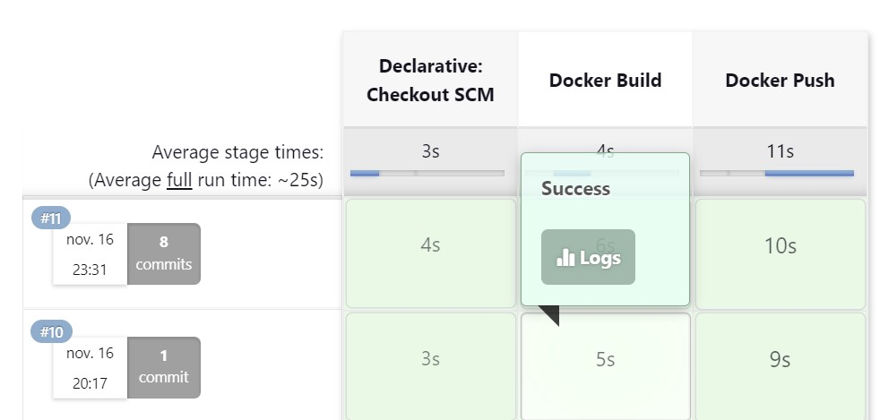

# MEP Gradle de Nicolas Kieger
 
[**Lien du projet Docker Hub**](https://hub.docker.com/r/nicokgr/mep-backend)

# Partie 1 - LOCAL

> Afin de réaliser cette partie, il vous faudra copier ce dépot en local à l'aide de la commande : **`git clone https://github.com/Ocin57/MEP-covid-api.git`**

## Information
*N'ayant pas réussi à trouver une image jre sous openjdk pour avoir un conteneur moins volumineux contenant juste la partie exécutable de java, j'utilise donc une image jdk qui est donc plus volumineuse.*

## Commande afin de build les conteneurs Backend et Postgres

```shell
docker compose up --build -d
```

## Ajouter des centres dans la DB
### - Ouvrir une interface bash sur le conteneur Postgres:

```shell
docker compose exec -it db bash
```

### - Se connecter à postgres avec le mot de passe "postgres" :

```shell
psql -h localhost -p 5432 -U postgres -d postgres
```

### - Insérer des données à l'aide des commandes suivantes:

```sql
INSERT INTO vaccination_center (id,address,city, name, postal_code) VALUES (1, '5 rue du poisson','Paris','Centre de Paris','75000');
INSERT INTO vaccination_center (id,address,city, name, postal_code) VALUES (2, '2 rue de Brabois','Nancy','Centre de Nancy','54000');
```

#### - Vérifier les insertions précédentes: 

```sql
SELECT * FROM vaccination_center;
```

### - Quitter Postgres puis la connexion docker en faisant les commandes : 

```shell
\q
```
```shell
exit
```

## Test l'API-REST de notre backend en affichant tous les centres de vaccination

> **Par défaut, il n'y a aucun centre dans la base de donnée, et donc rien ne s'affichera.**
* [Ajouter des centres dans la DB](#Ajouter-des-centres-dans-la-DB)

```
GET http://localhost:8081/api/center/
```

Vous pouvez également utiliser la commande suivante:

```shell
curl 'http://localhost:8081/api/center/'
```

## Arrêt des conteneurs

```shell
docker compose down
```


# Partie 2 - JENKINS

## Installation Jenkins
```shell
git clone https://github.com/jredel/jenkins-compose.git
```
> *Faire la commande ``docker compose up`` puis Récupérer le mot de passe dans les logs docker*

## Ajout d'un credentials Jenkins pour Docker-HUB
- Se rendre dans :
``Tableau de bord`` > ``Administrer Jenkins`` > ``Identifiants (Crédentials)`` > ``System`` > ``Identifiants globaux (illimité)``
- Ajouter un credential avec les paramètres suivants:
    - Nom d'utilisateur : ``Nom d'utilisateur Docker Hub``
    - Mot de passe : ``Mot de passe Docker Hub``
    - ID : ``dockerHub``

## Création d'une pipeline

Il existe deux possibilités afin d'établir une pipeline Jenkins. Soit on peut faire une **``pipeline simple``** avec un script qui sera écrit directement dans la pipeline.
Soit on peut créer une **``pipeline multibranches``** dans laquelle il faut renseigner le ou les répo(s) à cloner directement dans Jenkins. Il s'occupera de les cloner et utilisera le script se trouvant dans le fichier Jenkinsfile pour chaque répo cloné.

### Pipeline:


Mettre le code suivant dans ``Pipeline`` -> ``Script`` :
```groovy
pipeline {
    agent any
    stages {   
        // Git Clone uniquement si l'on créer un Pipeline unique sur Jenkins
        stage('Git Clone') {
            steps {
                echo 'Git Clone'
                sh 'git clone https://github.com/Ocin57/MEP-covid-api.git'
            }
        }  
        stage('Docker Build') {
            steps {
                echo 'Docker Build'

                // Build uniquement l'image du backend 
                //sh 'docker build -t nicokgr/mep-backend:latest .'

                // Build de toutes les images définis dans docker-compose
                sh 'docker compose build'
            }
        }
        stage('Docker Push') {
            steps {
                echo 'Docker push'
                withCredentials([usernamePassword(credentialsId: 'dockerHub', passwordVariable: 'dockerHubPassword', usernameVariable: 'dockerHubUser')]) {
                    sh "docker login -u ${env.dockerHubUser} -p ${env.dockerHubPassword}"

                    // Push uniquement l'image du backend
                    //sh 'docker push nicokgr/mep-backend:latest'

                    // Push de toutes les images du docker-compose souhaitées
                    sh 'docker compose push'
                }
            }
        }
    }
}
```

> **La pipeline est configuré, vous pouvez sauvegarder et lancer le build.**

### Pipeline Multibranches


Dans ``Branch Sources`` cliquer sur ``Add Source`` puis ``GitHub``.

Mettre dans ``Repository HTTPS URL`` l'adresse du répo GitHub à cloner : 
> ``https://github.com/Ocin57/MEP-covid-api.git``

Puis sauvegarder ainsi.

## Lancer et vérifier un premier build
Vous devriez voir le Docker Build se réaliser avec succès puis le Docker Push être également réalisé avec succès.



# Sources
* https://github.com/Ocin57/MEP-covid-api.git
* https://github.com/jredel/jenkins-compose
